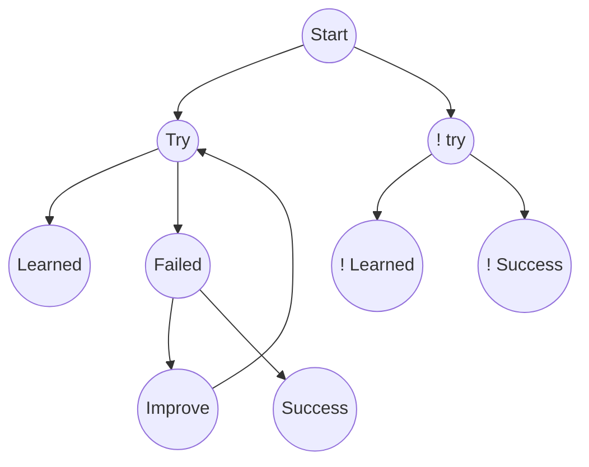

- 👋 Hi, I’m @srinu2003
- 🎓 Pursuing B.tech in Computer Science Engineering  at 🏫 [MLR Institute of Technology and Management](https://mlritm.ac.in/)
- 📫 tsrin2003@gmail.com
- 👀 I’m interested in Design and Development
- 🌱 I’m currently learning JAVA/[Flutter](https://flutter.dev/)/HTML
<!-- - 💞️ I’m looking to collaborate on ... -->
---
<!-- -
srinu2003/srinu2003 is a ✨ special ✨ repository because its `README.md` (this file) appears on your GitHub profile.
You can click the Preview link to take a look at your changes.
- -->

